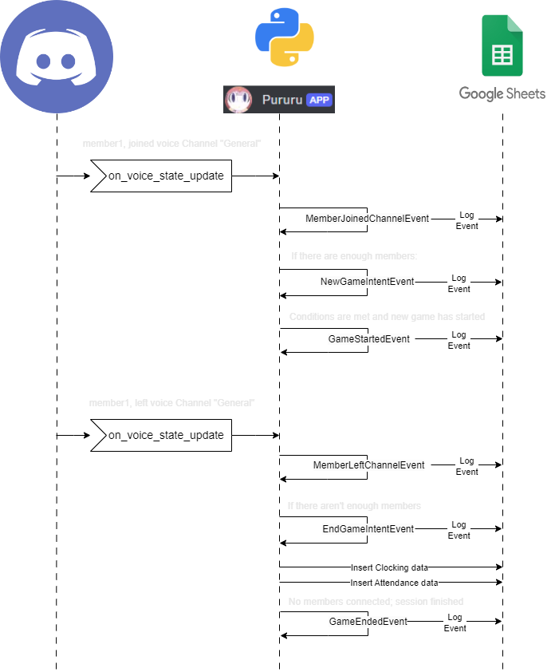
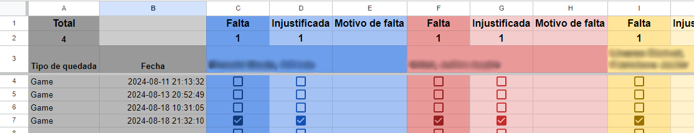
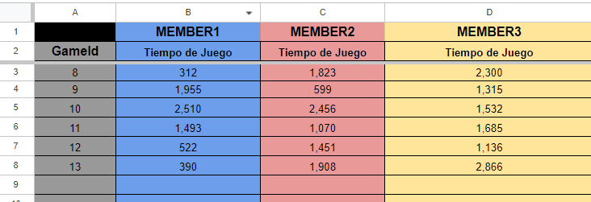
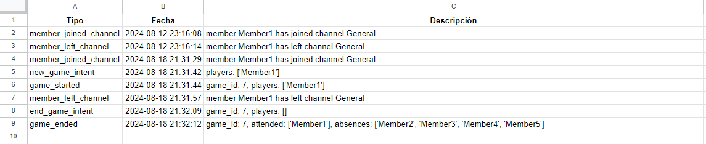

# Pururu Bot

This is the repository for the Discord bot Pururu.

This bot is a private project for a Discord server, and it is not intended to be used by other servers.

## Purpose

The purpose of this bot is to provide a set of tools to the users of the server, such as:

- Automatic Attendance Control
- Clock in and out
- Absences control

## Dependencies

### Discord API

The app is fully-dependent on the Discord API, hence, it
uses [Discord.py](https://discordpy.readthedocs.io/en/latest/index.html) to interact with the API.

### Google Sheets API

The app is designed to use a google sheet as the main database service, for this, it uses
the [Google Sheets API](https://developers.google.com/sheets/api).

The why of this is because originally everything was done by hand using a Google sheet, so when I was planing this bot
I wanted to preserve the easy way of visualizing and editing the data a google sheet provides.

## How it works?

Here is a flow diagram of how the bot works:

It only uses the `on_voice_state_update` event to track the users' attendance. After meting the conditions to start a
new Game (attendance check) it will start recording every event locally so when the game finishes it will be inserted to
the google sheet.

### Attendance

Here is an example of how the attendance sheet would look like:

### Clocking

Here is an example of how the clocking sheet would look like:

### Event Logging

Here is an example of how the event logging sheet would look like:

## Bot Commands

No bot commands are currently implemented.

## Deployment

The app is configured to be deployed in an EC2 instance from AWS, to do so, it uses the deployment workflow from github
actions.

## Contributing

Even that this a private project for an specific needs, feel free to submit a pull request, every suggestion is welcome.

## Versioning

We use [Semantic Versioning](http://semver.org/) for versioning. For the versions
available, see the [tags on this
repository](https://github.com/jlvadell/pururu-bot/tags).

## Authors

- **José Vadell** - [jlvadell](https://github.com/jlvadell)

## License

This project is licensed under the [Apache License 2.0](LICENSE).